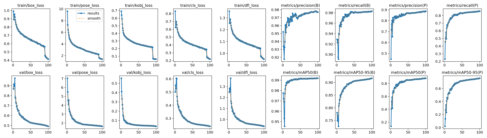

<div align="center">

# YOLO11n-pose Hand Keypoint Detection


##### As shown in this test video, the trained model struggles to accurately detect keypoints for gestures like pinching and swiping. However, it performs well in identifying keypoints on open hands, whether facing forward or backward.

</div>

<br>

### Run your own tests with this model
Clone the repository
```
git clone https://github.com/chrismuntean/YOLO11n-pose-hands.git
```

Install dependencies (just need `Ultralytics` and its dependencies)
```
pip install -r requirements.txt
```
Run the webcam test on your machine
```
python webcam-test.py
```
**Note:** Test videos saved to `/runs/pose/output/test/<#>.avi`

<br>

<div align="center">

### Download the trained `best.pt` file [here](https://github.com/chrismuntean/YOLO11n-pose-hands/blob/bda894403f378d2a298d2f88ae9d5ed6d4e9f8e3/runs/pose/train/weights/best.pt)

</div>

<br>

### Model Metrics

<div align="center">
    
</div>